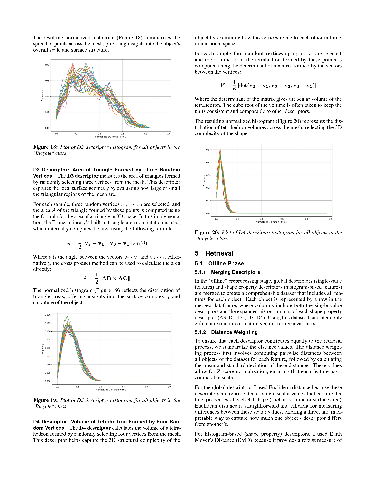

# Content-Based Multimedia Retrieval 

The reposirtory is complete and the UI can be ran immediately without applying preprocessing.
In case you want to run the whole process from scratch, here is the manual:
## How to Run the Code

### Preprocessing and Evaluation
1. **Preprocessing**  
   Run the `prep_main.py` file to preprocess the dataset. This script sequentially handles:  
   - `prep_resampling.py`  
   - `prep_remeshing.py`  
   - `prep_normalizing.py`  

2. **Feature Extraction**  
   Run the `desc_main.py` file to extract features. This script handles:  
   - `desc_global.py`  
   - `desc_local.py`  
   - `desc_weighting.py`  

3. **Evaluation Metrics**  
   - Run `evaluation_metrics.py` to compute Precision@10 and Recall for linear similarity retrieval.  
   - Run `knn.py` to compute Precision@10 and Recall for KDTree similarity retrieval.

### User Interface (UI)
To use the UI, which includes the shape viewer and retrieval engine, run the `ui_main.py` file.

### Additional Analysis
The `extra.ipynb` notebook contains code for:  
- Result computations  
- Plots  
- Testing of the global descriptors  

## Report

